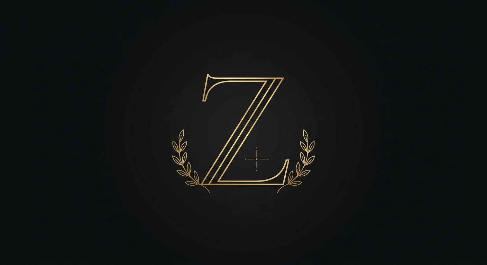

# cursi_presentation — site personnel de Zzz_cursi



Site personnel de **Zzz_cursi (ᴄᴜʀsɪ)** — 19 ans, étudiant en informatique à
Brazzaville (Congo), joueur Free Fire **Élite Héroïque** du clan **ɴᴏᴛ ʟɪᴋ s**,
sur le jeu depuis **2019**.

> « Étudier le jour, *Booyah* la nuit. »

## ✨ Fonctionnalités

- **Responsive / mobile-first** — Flexbox & CSS Grid, menu burger mobile
- **Mode sombre / mode clair** — bouton de bascule dans la barre de navigation,
  choix mémorisé (localStorage)
- **Animations fluides** — apparition au défilement (IntersectionObserver,
  équivalent AOS sans dépendance), compteurs animés, barres de compétences
- **Typographie** — Cormorant Garamond + Jost (Google Fonts) et **Fira Code**
  pour les badges techniques
- **Sections** : Accueil (hero + CTA), Moi, Mon monde (compétences classées),
  Projets (cartes avec image, badges de technos, liens code source / démo),
  Parcours, Galerie (visionneuse), Contact (formulaire validé + liens sociaux)
- **SEO & Open Graph** — `<title>`, `meta description`, OG tags pour une belle
  carte de partage sur Discord / WhatsApp

## 🛠️ Technologies

HTML5 · CSS3 · JavaScript vanilla (aucune dépendance) · Google Fonts

## 🚀 Lancer en local

```bash
git clone https://github.com/khalixcursi-stack/cursi_presentation.git
cd cursi_presentation
python3 -m http.server 8080
# ouvrir http://localhost:8080
```

## 🌍 Déploiement (URL publique)

Le site est 100 % statique : il fonctionne sur **GitHub Pages**, **Netlify**
ou **Vercel** sans configuration.

**GitHub Pages (1 clic) :**
1. Sur GitHub : *Settings → Pages*
2. *Source* : **Deploy from a branch** → branche `arena/01a0c04a-cursi-presentation`, dossier `/ (root)` → *Save*
3. URL publique : `https://khalixcursi-stack.github.io/cursi_presentation/`

*(L'activation automatique via l'API GitHub n'est pas permise par le jeton de
ce workspace — d'où la manipulation manuelle ci-dessus.)*

## 📁 Structure

```
cursi_presentation/
├── index.html              # page unique (toutes les sections)
├── assets/
│   ├── css/style.css       # styles + thème clair/sombre
│   ├── js/main.js          # thème, animations, compteurs, lightbox, formulaire
│   └── img/                # emblem, personnage, moments, emblème de clan
└── README.md
```

## 🔗 Me contacter

- E-mail : baralangui7@gmail.com
- Discord : https://discord.gg/W7S3YdKE
- WhatsApp : https://wa.me/qr/4PWVMBD2JGTQI1
- Instagram : https://www.instagram.com/zzz_cursi
